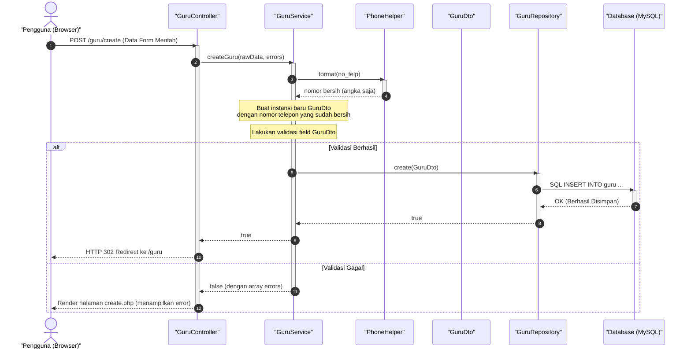

# Penjelasan Arsitektur: Alur Request & Perbandingan MVC vs Enterprise

Dokumen ini menjelaskan bagaimana HTTP Request diproses dalam arsitektur baru modul CRUD Guru, serta perbandingannya dengan arsitektur MVC (Model-View-Controller) tradisional.

---

## 1. Alur Pemrosesan Request (Siklus Hidup Request)

Diagram di bawah ini menggambarkan apa yang terjadi ketika Anda mengirimkan form tambah guru di `/guru/create`:



### Penjelasan Langkah demi Langkah:
1. **Langkah 1**: Pengguna mengklik tombol **"Simpan Guru"**. Browser mengirimkan data form mentah melalui request `POST /guru/create`.
2. **Langkah 2**: `GuruController` menerima request, membaca data mentah, dan langsung mendelegasikannya ke `GuruService::createGuru()`.
3. **Langkah 3-4**: `GuruService` memanggil `PhoneHelper::format()` untuk menyaring nomor telepon dari karakter seperti spasi, tanda hubung (`-`), atau tanda kurung.
4. **Langkah 5**: Objek **DTO** (`GuruDto`) dibuat secara aman untuk membungkus data masukan.
5. **Langkah 6**: `GuruService` memvalidasi isi DTO (misalnya, memastikan email berformat benar dan field wajib diisi).
6. **Langkah 7-10 (Sukses)**: Jika validasi lolos, DTO dikirim ke `GuruRepository`. Repositori menjalankan perintah `INSERT` ke database MySQL. Jika sukses, Controller merespons dengan mengalihkan halaman (HTTP 302 Redirect) ke daftar guru.
7. **Langkah 11-12 (Gagal)**: Jika validasi gagal, Service mengembalikan nilai `false` beserta daftar pesan kesalahan (`errors`). Controller kemudian merender kembali halaman tambah guru dan menampilkan pesan kesalahan tersebut.

---

## 2. Peta Perbandingan: MVC Tradisional vs Arsitektur Enterprise (3-Tier)

Untuk mempermudah pemahaman Anda, mari bandingkan struktur alur data dari kedua pendekatan ini:

### Pendekatan MVC Tradisional (Fat Model / Active Record)
Dalam MVC tradisional, Controller langsung berbicara dengan model database (`ActiveRecord`), dan View juga langsung membaca data database tersebut.

```
+---------+         +------------------+         +-----------------+
| Browser | ------> |  GuruController  | ------> |   Guru (Model)  |
+---------+         +------------------+         +-----------------+
     ^                        |                           |
     |                        v                           v
     +-----------------  [   View   ] <-------------------+
```

- **Kelemahan**: Model memikul beban terlalu berat (*Fat Model*). Ia bertugas mengatur SQL, validasi, logika bisnis, sekaligus representasi data. Ini membuat kode sulit dirawat jika sistem berkembang menjadi besar.

### Pendekatan Enterprise (Decoupled / 3-Tier)
Dalam arsitektur baru, tugas Model dipecah menjadi komponen-komponen kecil yang saling independen:

```
+---------+         +------------------+         +-----------------+
| Browser | ------> |  GuruController  | ------> |     GuruDto     |
+---------+         +------------------+         +-----------------+
                              |                           |
                              v                           v
                    +------------------+         +-----------------+
                    |    GuruService   | <====== |   PhoneHelper   |
                    +------------------+         +-----------------+
                              |
                              v
                    +------------------+         +-----------------+
                    |  GuruRepository  | ------> | Database (MySQL)|
                    +------------------+         +-----------------+
                              |                           |
                              v                           v
                    +------------------+         +-----------------+
                    |    GuruFactory   | ------> |    GuruEntity   |
                    +------------------+         +-----------------+
                              |                           |
                              v                           v
                    [      View      ] <------------------+
```

- **Kelebihan**: Setiap berkas hanya memiliki satu tanggung jawab saja (**Single Responsibility Principle**). 
- **Keamanan Skema**: View tidak pernah tahu tentang nama tabel atau kueri database SQL. View hanya menerima objek **Entity** (`GuruEntity`) yang bersih.
- **Kemandirian Database**: Jika besok Anda memindahkan penyimpanan dari MySQL ke MongoDB atau API pihak ketiga, Anda **hanya perlu mengubah berkas `GuruRepository`**. Controller, Service, DTO, Entity, dan View Anda sama sekali tidak perlu diubah!
